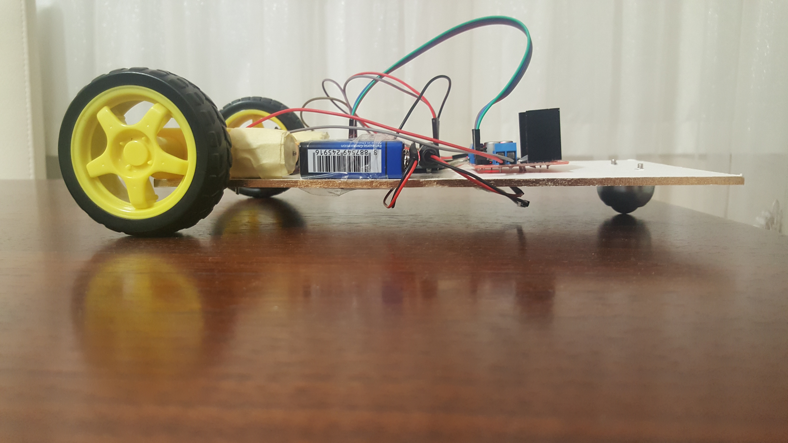

# Arduino-Bluetooth-Controlled-Car

* This project is a hoby project.
* This car controlled remotely by android phone.
* Project Video: https://youtu.be/ukCGyJJ3isk
* [source code](bluetooth_car.ino)

# How to works
1- Send command from android phone to bluetooth module.   
   (bluetooth module is on the car)   
2- Bluetooth module transmit command to arduino uno   
   (arduino uno is on the car)   
3- Arduino uno drives electrical motors via motor driver.   
4- Car moves with the specified direction.   

To controlling car from android phone we should download an android application.
The android application is: https://play.google.com/store/apps/details?id=com.giumig.apps.bluetoothserialmonitor&hl=en&gl=US

The configuration for the adroid application sould be like below: 

# Car components
* 1x Arduino Uno
* 1x HC-06 Bluetooth Module
* 1x L298N motor driver
* 2x DC Motor
* 3x Wheel
* 4x 1.5V Alkaline Battery
* 1x 9V Battery
* 1x Cardboard

